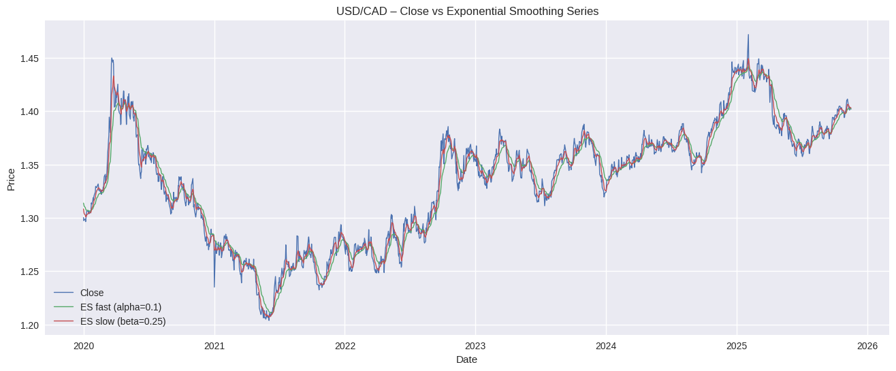

# FX Trend Strategy Using Exponential Smoothing  
### A Reproducible Quantitative Research Project by **Cheng Wu**

This repository presents a fully reproducible quantitative analysis of the **USD/CAD** exchange rate using **dual exponential smoothing (ES)** trend filters.  
The project evaluates whether simple smoothing-based signals—combined with hyperparameter tuning, buffer thresholds, and deceleration-based exits—can reliably capture FX trend persistence.

This work is implemented entirely in **Python**, includes a professional **LaTeX research report**, and is structured as a complete **end-to-end research pipeline**.

---

## Project Overview

FX markets often show medium-horizon trend behavior.  
To investigate this, I construct a **trend-following crossover model** using:

- **Fast exponential smoothing filter**: \( ES_\alpha \)  
- **Slow exponential smoothing filter**: \( ES_\beta \)  
- **Signal**: crossovers between the two filters  
- **Backtest window**: 2003–2025 (USD/CAD daily closes)

The project answers five key research questions:

1. **Is there an optimal combination of (α, β)?**  
2. **Should long and short positions use different parameters?**  
3. **What is the strategy’s true accuracy (“probability of being correct”)?**  
4. **Should positions be closed when the slow trend decelerates?**  
5. **Should entries require a minimum buffer (x) between ES filters?**

---

## Key Findings

- Optimal smoothing parameters: **α = 0.20**, **β = 0.60**  
- Long-only and short-only portfolios surprisingly choose the **same (α, β)**  
  → Trend *time horizon* is symmetric even if returns are not  
- **Trade-level accuracy ~73%**, vs. daily hit-rate ~50%  
- Buffer thresholds **reduce Sharpe** and meaningfully reduce opportunity  
- Deceleration-based exits **increase turnover** and hurt performance  
- The **simplest ES crossover** remains the strongest variant

---

## Methods & Techniques Used

- Time-series smoothing & signal engineering  
- Grid search over smoothing parameters  
- Backtesting (no look-ahead bias)  
- Performance statistics:  
  - Total return  
  - Annualized return & volatility  
  - Sharpe ratio  
  - Daily hit rate  
  - Trade-level hit rate  
- Sensitivity studies:  
  - Buffer \( x \)  
  - Deceleration threshold \( c \)  
- Data visualization (matplotlib)  
- Scientific reporting (LaTeX)

---

## Repository Structure
```
Exponential-Smoothing-Trend-Strategy/
│
├─ FX_Trend_Strategy_ES_Crossover.ipynb      # Full analysis & backtest  
├─ FX_Trend_Strategy_Report.pdf              # LaTeX report (Overleaf compiled)
│
├─ data/
│   └─ USD_CAD_Daily_OHLC_2003_2025.csv      # Cleaned OHLC data
│
├─ figures/
│   ├─ Sharpe_Heatmap.png
│   ├─ Buffer_vs_Sharpe.png
│   ├─ Buffer_vs_Trades.png
│   ├─ Decel_vs_Sharpe.png
│   ├─ Decel_vs_Trades.png
│   ├─ Strategy_Cumulative_Return.png
│   └─ ES_Crossover_Example.png
│
└─ README.md
```


---

## 📊 Example Figures

### 🔸 Sharpe Ratio Heatmap  
Optimal region around **(α = 0.20, β = 0.60)**.


---

### 🔸 Buffer Effect on Sharpe Ratio  
Increasing buffer \( x \) weakens performance.


---

### 🔸 Deceleration Threshold Effect  
Deceleration increases turnover and significantly reduces Sharpe.


---

### 🔸 Strategy Cumulative Return  
The crossover model captures medium-term FX trends.


---

### 🔸 Exponential Smoothing Filters  
Fast vs slow smoothing used to generate crossover signals.




---

## How to Run

### 1. Clone the repository
```bash
git clone https://github.com/<your-username>/<repo-name>.git
cd <repo-name>
```

### 2. Install dependencies


```bash
pip install pandas numpy matplotlib
```

### 3. Run the notebook

```bash
jupyter notebook FX_Trend_Strategy_ES_Crossover.ipynb
```

All tables & charts will be reproduced exactly.


## Why This Project Matters (Hello Recruiters 👋)

This project demonstrates the full analytical pipeline expected in:

### ✔ Data Analyst / Business Analyst Roles
- Structured problem decomposition  
- Clear hypothesis-driven experimentation (buffer & deceleration tests)  
- Insight-focused narrative and communication  
- Ability to translate quantitative results into business-relevant insights  

### ✔ Market Intelligence / Research Analyst Roles
- Quantitative trend and behavior analysis  
- Parameter tuning and interpretability  
- Understanding long/short asymmetry in financial time series  
- Evidence-based evaluation of strategy performance  

### ✔ Quant Strategy / Trading Research Roles
- Backtesting logic and signal construction  
- Risk-adjusted performance evaluation (Sharpe, volatility, hit rate)  
- Trade-level analytics — rarely demonstrated by students  
- Sensitivity testing of trading rules (entry/exit logic)  

### ✔ AI / Data Product Roles
- End-to-end reproducible workflow design  
- Clean & transparent modeling pipelines  
- Scientific documentation discipline (LaTeX + reproducible code)  
- Ability to build interpretable, tunable systems rather than black boxes  


---

## Skills Demonstrated

- **Python:** pandas, numpy, matplotlib  
- **Time-series modeling:** smoothing, trend extraction, crossover logic  
- **Quant research design:** grid search, signal engineering, backtesting  
- **Performance analytics:** Sharpe, total return, hit rates, volatility  
- **Hyperparameter tuning:** (α, β), buffer x, deceleration threshold c  
- **Data visualization:** parameter heatmaps, strategy curves, sensitivity charts  
- **Technical writing:** professional LaTeX research report  
- **Reproducible workflows:** clear folder structure, documented notebook  


---

## Full Technical Report

A polished LaTeX report (compiled via Overleaf) is included in this repository:

📎 **FX_Trend_Strategy_Report.pdf**

The report contains:
- Methodology  
- Mathematical formulation  
- All experiments (αβ grid search, buffer, deceleration)  
- Figures and tables  
- Discussion & interpretation  


---

## 👤 About the Author

**Cheng Wu**  
*M.S. in Data Science · Columbia University*
*B.S. in Econometrics & Quantitative Economics · University of Illinois at Urbana-Champaign*  
- Minor in Statistics · Data Science Certificate

**Focus Areas:**  
Data Analytics · Market Intelligence · Quant Strategy ·  
AI-Driven Decision Systems · Financial Modeling

- **Portfolio:** [chengwu-data.github.io](https://chengwu-data.github.io/)  
- **LinkedIn:** [linkedin.com/in/cheng-wu-1ab27922a](https://www.linkedin.com/in/cheng-wu-1ab27922a/)  
- **GitHub:** [github.com/ChengWu-Data](https://github.com/ChengWu-Data)  


